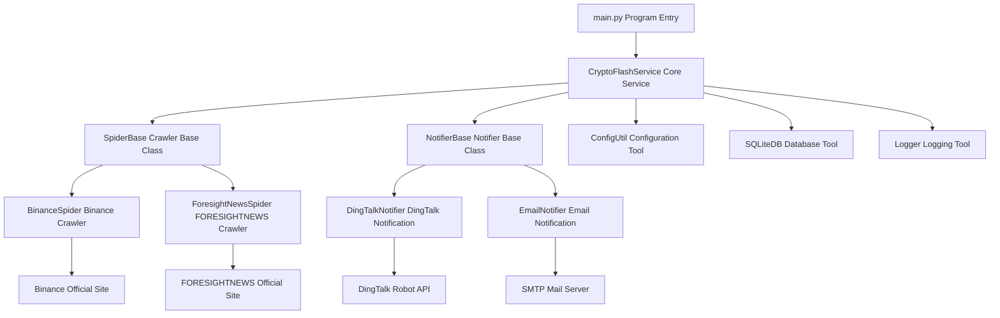
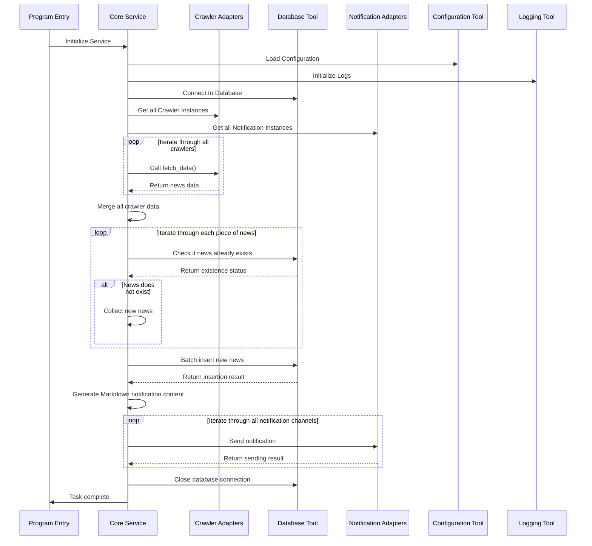

# CryptoFlash - Web3 News Push System

## 🌟 Project Introduction

CryptoFlash is a Web3 news push system based on the Adapter Pattern. It automatically crawls cryptocurrency-related news and pushes it to users in real-time through multiple notification channels. The system utilizes a modular design, supporting flexible expansion of crawler sources and notification sources to achieve the design goal of "adding new sources without modifying core code."

## ✨ Features

- 🕷️ **Multi-source Crawlers**: Supports various news sources such as Binance Exchange announcements, FORESIGHTNEWS, etc.
- 📢 **Multi-channel Notifications**: Supports multiple notification methods including DingTalk robots, email, etc.
- 📊 **Data Deduplication**: Based on an SQLite incremental data storage mechanism to avoid duplicate pushes.
- 🎨 **Markdown Format**: Supports Markdown-formatted notification content for an improved reading experience.
- 🔧 **Flexible Extension**: Uses the Adapter Pattern; adding new crawlers or notification channels only requires implementing the interface.
- 📦 **Lightweight Deployment**: Supports local deployment and automated deployment via GitHub Actions.
- 📝 **Detailed Logging**: Comprehensive log recording for easy troubleshooting and system monitoring.

## 🛠️ Technical Architecture

### Tech Stack

| Technology/Library | Version | Purpose |
|-------------------|--------|---------|
| Python | 3.8+ | Development Language |
| requests | 2.31.0 | Network Requests |
| curl_cffi | 0.9.0 | Network requests to bypass anti-crawling |
| fake_useragent | 1.5.1 | Generate random User-Agents |
| pyyaml | 6.0.1 | YAML configuration parsing |
| six | 1.17.0 | Python version compatibility tool |
| urllib3 | 1.25.11 | HTTP client library |

### Architecture Diagram



### Core Workflow



## 🚀 Quick Start

### Environment Requirements

- Python 3.8+
- pip

### Installation Steps

1. **Clone the project**

```bash
git clone https://github.com/yourusername/CryptoFlash.git
cd CryptoFlash
```

2. **Install dependencies**

```bash
pip install -r requirements.txt
```

3. **Configure environment**

Copy the configuration example and modify it:

```bash
cp config/custom-conf-sample.yml config/custom-conf.yml
```

Edit the `config/custom-conf.yml` file to configure crawlers and notification channels as needed.

4. **Run the program**

```bash
python main.py
```

## ⚙️ Detailed Configuration

### Configuration File Structure

```yaml
# Crawler Configuration
spiders:
  - type: binance
    url: "https://www.binance.com/zh-CN/support/announcement"
  - type: foresight_news
    url: "https://foresightnews.pro/news"
  - type: okx_boost
    url: "https://bscscan.com/address/0x000310fa98e36191ec79de241d72c6ca093eafd3"
  - type: twitter
    username: "Wuming_Mr_"
    nitter_instance: "https://nitter.net"

# Notification Configuration
notifiers:
  - type: dingtalk
    webhook: "https://oapi.dingtalk.com/robot/send?access_token=your-token"
    secret: "your-secret"
    sources: ["binance"] # Optional, only receive notifications from specified sources
  - type: bark
    api_url: "https://api.day.app"
    device_key: "your-device-key"
    sources: [] # If empty, receive from all sources
```

### Configuration Explanation

#### 1. Crawler Configuration

- **binance**: Binance Exchange announcement crawler configuration
  - `url`: URL of the Binance announcement page

- **foresight_news**: FORESIGHTNEWS news crawler configuration
  - `url`: FORESIGHTNEWS API URL

- **twitter**: Twitter tweet crawler configuration (based on Nitter RSS)
  - `username`: Twitter username (without @)
  - `nitter_instance`: Nitter instance address (e.g., https://nitter.net)
  - `url`: (Optional) Specify RSS URL directly; if specified, username and nitter_instance are ignored

#### 2. Notification Configuration

- **dingtalk**: DingTalk robot configuration
  - `webhook`: DingTalk robot Webhook address
  - `secret`: Signature key (Optional, used for enhanced security)

- **email**: Email notification configuration
  - `smtp_server`: SMTP server address
  - `smtp_port`: SMTP server port
  - `smtp_user`: Sender email
  - `smtp_password`: Email password or authorization code
  - `to_emails`: List of recipient emails

#### 3. System Configuration

- **pool**: Thread pool configuration
  - `max_workers`: Maximum number of worker threads

- **logger**: Logging configuration
  - `level`: Log level

## 📦 Execution Methods

### Local Execution

```bash
python main.py
```

### GitHub Actions Automated Execution

The system supports full configuration via environment variables and supports multi-instance configuration:

1. **Basic Configuration**:
   - `DINGTALK_WEBHOOK`: DingTalk robot Webhook
   - `DINGTALK_SECRET`: DingTalk robot Secret
   - `DINGTALK_SOURCES`: Source filtering (comma-separated, e.g., `binance,Foresightnews`)

2. **Multi-instance Configuration**:
   If you need to configure multiple notification tools of the same type, you can use commas (commas not inside brackets):
   - `DINGTALK_WEBHOOK`: "url1,url2"
   - `DINGTALK_SOURCES`: "['binance'],['foresightnews']"
   
   The above configuration will create two DingTalk notifiers: the first only listens to Binance, and the second only listens to ForesightNews.

3. **GitHub Secrets Setup**:
   Set the corresponding Secrets in your GitHub repository, and the workflow will load and run them automatically.

## 🧩 Development Guide

### Project Structure

```
CryptoFlash/
├── adapters/              # Adapters directory
│   ├── notifiers/        # Notification adapters
│   │   ├── __init__.py
│   │   ├── dingtalk_notifier.py
│   │   └── email_notifier.py
│   └── spiders/          # Crawler adapters
│       ├── __init__.py
│       ├── binance_spider.py
│       └── foresight_news_spider.py
├── config/               # Configuration file directory
│   └── custom-conf-sample.yml
├── core/                 # Core code
│   ├── __init__.py
│   ├── base.py          # Abstract base classes
│   └── service.py       # Core service
├── data/                 # Data storage
│   └── article_hashes.db
├── doc/                  # Documentation
│   ├── dev-design/      # Development design
│   ├── dev-progress/    # Development progress
│   └── plan-design/     # Requirement design
├── logs/                 # Logs directory
├── tests/                # Test code
├── utils/                # Utility classes
│   ├── __init__.py
│   ├── config.py        # Configuration tool
│   ├── database.py      # Database tool
│   └── logger.py        # Logging tool
├── main.py              # Program entry
├── requirements.txt     # Dependency file
└── README.md           # Project description
```

### Adding a New Crawler Source

1. Create a new crawler class inheriting from `SpiderBase`.
2. Implement the `fetch_data()` method, returning data in the specified format.

```python
from core.base import SpiderBase
from typing import List, Dict

class NewSpider(SpiderBase):
    def __init__(self):
        self.source = "new_source"
        
    def fetch_data(self) -> List[Dict]:
        # Implement data crawling logic
        data = []
        # ... crawling code ...
        return data
```

### Adding a New Notification Channel

1. Create a new notification class inheriting from `NotifierBase`.
2. Implement the `send_notification()` method.

```python
from core.base import NotifierBase
from typing import List, Dict

class NewNotifier(NotifierBase):
    def __init__(self):
        # Initialize notification configuration
        pass
        
    def send_notification(self, data: List[Dict], markdown_content: str = None) -> bool:
        # Implement notification sending logic
        # ... sending code ...
        return True
```

## 🧪 Testing

### Run Unit Tests

```bash
python -m pytest tests/
```

### Test File Description

- `tests/test_adapters_notifiers.py`: Notification adapter tests
- `tests/test_adapters_spiders.py`: Crawler adapter tests
- `tests/test_binance_spider.py`: Individual Binance crawler test
- `tests/test_foresight_news_spider.py`: Individual FORESIGHTNEWS crawler test
- `tests/test_core_service.py`: Core service tests
- `tests/test_utils_config.py`: Configuration tool tests
- `tests/test_utils_database.py`: Database tool tests

## 📝 Contribution Guide

Community contributions are welcome! Please follow these steps:

1. Fork this project.
2. Create a feature branch (`git checkout -b feature/AmazingFeature`).
3. Commit your changes (`git commit -m 'Add some AmazingFeature'`).
4. Push to the branch (`git push origin feature/AmazingFeature`).
5. Open a Pull Request.

### Coding Standards

- Follow PEP 8 coding standards.
- Add detailed comments to core functional code.
- Add unit tests for new features.
- Use type hints to improve code readability.

## 📄 License

This project is licensed under the MIT License - see the [LICENSE](LICENSE) file for details.

## 🤝 Contact

If you have any questions or suggestions, please contact via:

- Submit an Issue: https://github.com/yourusername/CryptoFlash/issues
- Email: your-email@example.com

## 📊 Development Progress

| Phase | Progress | Completion Date |
|-------|----------|------------------|
| Requirement Analysis & Design | ✅ 100% | 2025-12-15 |
| System Architecture Design | ✅ 100% | 2025-12-15 |
| Core Feature Implementation | ✅ 100% | 2025-12-17 |
| Testing & Debugging | ✅ 100% | 2025-12-18 |
| Documentation Writing | ✅ 100% | 2025-12-19 |
| Deployment & Go-live | ✅ 100% | 2025-12-19 |

---

**Give this project a Star ⭐ to show your support!** 🚀
