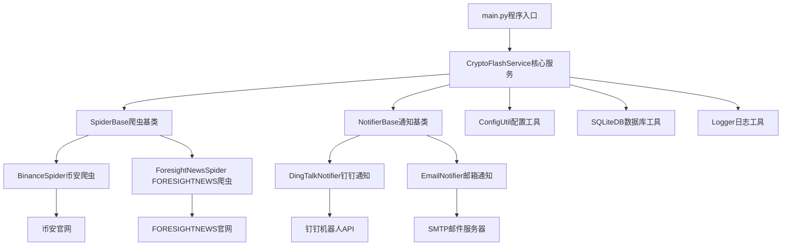
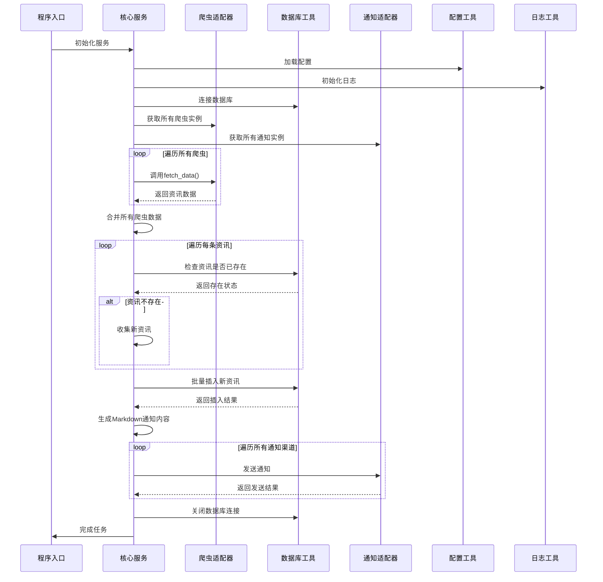

# CryptoFlash - Web3资讯推送系统

## 🌟 项目介绍

CryptoFlash是一个基于适配器模式的Web3资讯推送系统，能够自动爬取加密货币相关资讯，并通过多种通知渠道实时推送给用户。系统采用模块化设计，支持灵活扩展爬虫源和通知源，实现"新增源无需修改核心代码"的设计目标。

## ✨ 功能特性

- 🕷️ **多源爬虫**：支持币安交易所公告、FORESIGHTNEWS等多种资讯源
- 📢 **多渠道通知**：支持钉钉机器人、邮件等多种通知方式
- 📊 **数据去重**：基于SQLite的增量数据存储机制，避免重复推送
- 🎨 **Markdown格式**：支持Markdown格式的通知内容，提升阅读体验
- 🔧 **灵活扩展**：采用适配器模式，新增爬虫或通知渠道只需实现接口
- 📦 **轻量级部署**：支持本地部署和GitHub Actions自动化部署
- 📝 **详细日志**：完整的日志记录，便于问题排查和系统监控

## 🛠️ 技术架构

### 技术栈

| 技术/库 | 版本 | 用途 |
|---------|------|------|
| Python | 3.8+ | 开发语言 |
| requests | 2.31.0 | 网络请求 |
| curl_cffi | 0.9.0 | 绕过反爬的网络请求 |
| fake_useragent | 1.5.1 | 生成随机User-Agent |
| pyyaml | 6.0.1 | YAML配置解析 |
| six | 1.17.0 | Python版本兼容工具 |
| urllib3 | 1.25.11 | HTTP客户端库 |

### 架构设计图



### 核心流程



## 🚀 快速开始

### 环境要求

- Python 3.8+
- pip

### 安装步骤

1. **克隆项目**

```bash
git clone https://github.com/yourusername/CryptoFlash.git
cd CryptoFlash
```

2. **安装依赖**

```bash
pip install -r requirements.txt
```

3. **配置环境**

复制配置文件示例并修改：

```bash
cp config/custom-conf-sample.yml config/custom-conf.yml
```

编辑`config/custom-conf.yml`文件，根据需要配置爬虫和通知渠道。

4. **运行程序**

```bash
python main.py
```

## ⚙️ 详细配置

### 配置文件结构

```yaml
# 爬虫配置
spiders:
  - type: binance
    url: "https://www.binance.com/zh-CN/support/announcement"
  - type: foresight_news
    url: "https://foresightnews.pro/news"
  - type: okx_boost
    url: "https://bscscan.com/address/0x000310fa98e36191ec79de241d72c6ca093eafd3"

# 通知配置
notifiers:
  - type: dingtalk
    webhook: "https://oapi.dingtalk.com/robot/send?access_token=your-token"
    secret: "your-secret"
    sources: ["binance"] # 可选，只接收指定来源的通知
  - type: bark
    api_url: "https://api.day.app"
    device_key: "your-device-key"
    sources: [] # 为空则接收所有来源
```

### 配置说明

#### 1. 爬虫配置

- **binance**: 币安交易所公告爬虫配置
  - `url`: 币安公告页面URL

- **foresight_news**: FORESIGHTNEWS资讯爬虫配置
  - `url`: FORESIGHTNEWS API URL

#### 2. 通知配置

- **dingtalk**: 钉钉机器人配置
  - `webhook`: 钉钉机器人Webhook地址
  - `secret`: 签名密钥（可选，用于增强安全性）

- **email**: 邮箱通知配置
  - `smtp_server`: SMTP服务器地址
  - `smtp_port`: SMTP服务器端口
  - `smtp_user`: 发件人邮箱
  - `smtp_password`: 邮箱密码或授权码
  - `to_emails`: 收件人邮箱列表

#### 3. 系统配置

- **pool**: 线程池配置
  - `max_workers`: 最大工作线程数

- **logger**: 日志配置
  - `level`: 日志级别

## 📦 运行方式

### 本地运行

```bash
python main.py
```

### GitHub Actions 自动化运行

系统支持通过环境变量进行全量配置，且支持多实例配置：

1. **基础配置**：
   - `DINGTALK_WEBHOOK`: 钉钉机器人Webhook
   - `DINGTALK_SECRET`: 钉钉机器人密钥
   - `DINGTALK_SOURCES`: 来源过滤（逗号分隔，如 `binance,foresightnews`）

2. **多实例配置**：
   如果需要配置多个同类型的通知器，可以使用逗号分隔（不在中括号内的逗号）：
   - `DINGTALK_WEBHOOK`: "url1,url2"
   - `DINGTALK_SOURCES`: "['binance'],['foresightnews']"
   
   上述配置将创建两个钉钉通知器，第一个只监听币安，第二个只监听ForesightNews。

3. **GitHub Secrets 设置**：
   在GitHub仓库中设置相应的Secrets，工作流将自动加载并运行。

## 🧩 开发指南

### 项目结构

```
CryptoFlash/
├── adapters/              # 适配器目录
│   ├── notifiers/        # 通知适配器
│   │   ├── __init__.py
│   │   ├── dingtalk_notifier.py
│   │   └── email_notifier.py
│   └── spiders/          # 爬虫适配器
│       ├── __init__.py
│       ├── binance_spider.py
│       └── foresight_news_spider.py
├── config/               # 配置文件目录
│   └── custom-conf-sample.yml
├── core/                 # 核心代码
│   ├── __init__.py
│   ├── base.py          # 抽象基类
│   └── service.py       # 核心服务
├── data/                 # 数据存储
│   └── article_hashes.db
├── doc/                  # 文档
│   ├── dev-design/      # 开发设计
│   ├── dev-progress/    # 开发进度
│   └── plan-design/     # 需求设计
├── logs/                 # 日志目录
├── tests/                # 测试代码
├── utils/                # 工具类
│   ├── __init__.py
│   ├── config.py        # 配置工具
│   ├── database.py      # 数据库工具
│   └── logger.py        # 日志工具
├── main.py              # 程序入口
├── requirements.txt     # 依赖文件
└── README.md           # 项目说明
```

### 新增爬虫源

1. 创建新的爬虫类，继承自`SpiderBase`
2. 实现`fetch_data()`方法，返回指定格式的数据

```python
from core.base import SpiderBase
from typing import List, Dict

class NewSpider(SpiderBase):
    def __init__(self):
        self.source = "new_source"
        
    def fetch_data(self) -> List[Dict]:
        # 实现数据爬取逻辑
        data = []
        # ...爬取代码...
        return data
```

### 新增通知渠道

1. 创建新的通知类，继承自`NotifierBase`
2. 实现`send_notification()`方法

```python
from core.base import NotifierBase
from typing import List, Dict

class NewNotifier(NotifierBase):
    def __init__(self):
        # 初始化通知配置
        pass
        
    def send_notification(self, data: List[Dict], markdown_content: str = None) -> bool:
        # 实现通知发送逻辑
        # ...发送代码...
        return True
```

## 🧪 测试

### 运行单元测试

```bash
python -m pytest tests/
```

### 测试文件说明

- `tests/test_adapters_notifiers.py`: 通知适配器测试
- `tests/test_adapters_spiders.py`: 爬虫适配器测试
- `tests/test_binance_spider.py`: 币安爬虫单独测试
- `tests/test_foresight_news_spider.py`: FORESIGHTNEWS爬虫单独测试
- `tests/test_core_service.py`: 核心服务测试
- `tests/test_utils_config.py`: 配置工具测试
- `tests/test_utils_database.py`: 数据库工具测试

## 📝 贡献指南

欢迎社区贡献！请按照以下步骤进行：

1. Fork本项目
2. 创建特性分支 (`git checkout -b feature/AmazingFeature`)
3. 提交更改 (`git commit -m 'Add some AmazingFeature'`)
4. 推送到分支 (`git push origin feature/AmazingFeature`)
5. 打开Pull Request

### 代码规范

- 遵循PEP 8编码规范
- 核心功能代码需添加详细注释
- 为新功能添加单元测试
- 使用类型注解提高代码可读性

## 📄 许可证

本项目采用MIT许可证 - 查看[LICENSE](LICENSE)文件了解详情。

## 🤝 联系方式

如有问题或建议，欢迎通过以下方式联系：

- 提交Issue: https://github.com/yourusername/CryptoFlash/issues
- 发送邮件: your-email@example.com

## 📊 开发进度

| 阶段 | 进度 | 完成时间 |
|------|------|----------|
| 需求分析与设计 | ✅ 100% | 2025-12-15 |
| 系统架构设计 | ✅ 100% | 2025-12-15 |
| 核心功能实现 | ✅ 100% | 2025-12-17 |
| 测试与调试 | ✅ 100% | 2025-12-18 |
| 文档编写 | ✅ 100% | 2025-12-19 |
| 部署上线 | ✅ 100% | 2025-12-19 |

---

**Star ⭐ 支持一下这个项目！** 🚀

