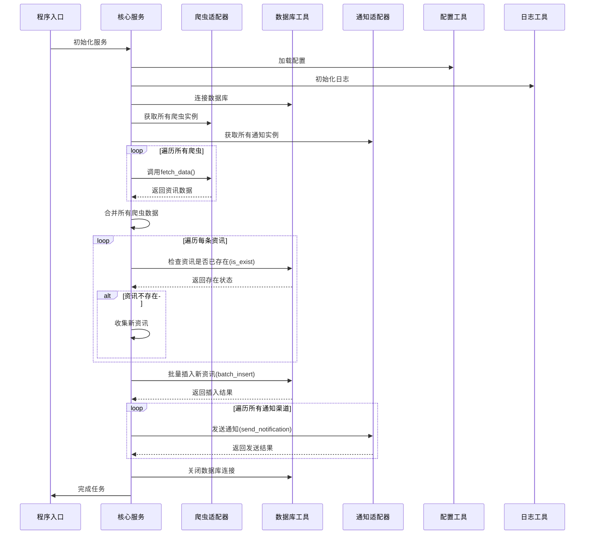

# Web3资讯推送系统技术设计文档

## 一、技术架构图

```mermaid
graph TD
    subgraph 客户端层
        A[main.py程序入口]
    end

    subgraph 核心服务层
        B[NewsPushService核心服务]
    end

    subgraph 抽象接口层
        C1[SpiderBase爬虫基类]
        C2[NotifierBase通知基类]
    end

    subgraph 适配器层
        D11[BinanceSpider币安爬虫]
        D12[ForesightNewsSpider FORESIGHTNEWS爬虫]
        D21[DingTalkNotifier钉钉通知]
        D22[EmailNotifier邮箱通知]
    end

    subgraph 工具类层
        E1[ConfigUtil配置工具]
        E2[SQLiteDB数据库工具]
        E3[Logger日志工具]
    end

    subgraph 外部资源
        F1[币安官网]
        F2[FORESIGHTNEWS官网]
        F3[钉钉机器人API]
        F4[SMTP邮件服务器]
    end

    %% 连接关系
    A --> B
    B --> C1
    B --> C2
    B --> E1
    B --> E2
    B --> E3
    C1 <|-- D11
    C1 <|-- D12
    C2 <|-- D21
    C2 <|-- D22
    D11 --> F1
    D12 --> F2
    D21 --> F3
    D22 --> F4
```

## 二、工作流程图



## 三、技术架构设计

### 1. 适配器模式设计

#### 1.1 爬虫适配器
- **抽象目标**：`SpiderBase`类定义统一的`fetch_data()`方法
- **适配器实现**：具体爬虫类继承`SpiderBase`并实现`fetch_data()`方法
- **优点**：新增爬虫源只需实现适配器，无需修改核心代码

#### 1.2 通知适配器
- **抽象目标**：`NotifierBase`类定义统一的`send_notification()`方法
- **适配器实现**：具体通知类继承`NotifierBase`并实现`send_notification()`方法
- **优点**：新增通知渠道只需实现适配器，无需修改核心代码

### 2. 工具类设计

#### 2.1 配置工具(ConfigUtil)
- **设计模式**：单例模式
- **功能**：统一读取YAML配置文件，支持多级配置项访问
- **实现要点**：
  - 延迟加载配置文件
  - 支持配置项默认值
  - 异常处理机制

#### 2.2 数据库工具(SQLiteDB)
- **功能**：封装SQLite数据库操作，实现资讯去重和存储
- **实现要点**：
  - 自动创建数据库和表结构
  - 批量插入优化
  - 资源自动释放

#### 2.3 日志工具(Logger)
- **功能**：统一日志格式，支持控制台和文件输出
- **实现要点**：
  - 彩色日志输出
  - 日志分级管理
  - 自动创建日志目录

### 3. 核心服务设计

#### 3.1 NewsPushService
- **功能**：协调爬虫采集、数据存储、通知推送的业务逻辑
- **实现要点**：
  - 依赖注入设计，支持任意爬虫和通知组合
  - 事务管理（确保数据一致性）
  - 异常处理和资源清理
  - 性能优化（批量操作）

### 4. 配置文件设计

#### 4.1 custom-conf.yml
- **格式**：YAML
- **内容**：
  - 爬虫源配置（URL等）
  - 通知渠道配置（Webhook、SMTP等）
  - 系统参数配置

#### 4.2 custom-conf-sample.yml
- **功能**：配置文件示例，用于指导用户配置
- **内容**：与custom-conf.yml结构相同，但使用占位符代替真实值

## 四、代码复用分析

### 1. 抽象类复用
- `SpiderBase`和`NotifierBase`作为抽象基类，定义了统一的接口规范
- 所有具体爬虫和通知类都继承自这些抽象类，确保接口一致性

### 2. 工具类复用
- `ConfigUtil`、`SQLiteDB`、`Logger`等工具类可在多个模块中复用
- 工具类采用单例模式或静态方法设计，方便调用

### 3. 异常处理复用
- 统一的异常处理机制，确保系统稳定性
- 日志记录统一使用`Logger`工具，保证日志格式一致性

### 4. 数据结构复用
- 爬虫返回的数据结构和通知接收的数据结构保持一致
- 统一的数据结构设计，减少数据转换开销

## 五、扩展性设计

### 1. 爬虫源扩展
- 新增爬虫源只需创建新的爬虫类，继承`SpiderBase`并实现`fetch_data()`方法
- 在配置文件中添加新爬虫的配置项
- 在`main.py`中注册新爬虫类

### 2. 通知源扩展
- 新增通知渠道只需创建新的通知类，继承`NotifierBase`并实现`send_notification()`方法
- 在配置文件中添加新通知的配置项
- 在`main.py`中注册新通知类

### 3. 数据存储扩展
- 数据库工具类封装了底层存储实现，可轻松切换到其他数据库（如MySQL、MongoDB）
- 只需修改`SQLiteDB`类的实现，保持接口不变

### 4. 配置管理扩展
- 配置工具类支持多种配置源（文件、环境变量等）
- 可扩展支持JSON、INI等其他配置格式

## 六、性能优化

### 1. 批量操作
- 数据库操作使用批量插入，减少数据库连接开销
- 通知发送可考虑批量处理，避免频繁请求外部服务

### 2. 缓存机制
- 可考虑添加缓存层，减少重复爬取相同内容
- 缓存可使用内存缓存或Redis等外部缓存系统

### 3. 异步处理
- 爬虫采集和通知发送可使用异步IO，提高系统并发能力
- 可使用Python的asyncio库实现异步操作

### 4. 错误重试
- 对网络请求和外部服务调用添加重试机制
- 设置合理的重试次数和间隔时间，提高系统稳定性

## 七、安全设计

### 1. 配置安全
- 敏感配置信息（如密码、密钥）存储在独立的配置文件中
- 配置文件不提交到版本控制系统
- 使用环境变量存储敏感信息（可选）

### 2. 网络安全
- 对外部API请求使用HTTPS协议
- 实现请求频率控制，避免被目标网站封IP
- 合理设置请求头，模拟真实浏览器行为

### 3. 数据安全
- 数据库文件设置合理的权限控制
- 敏感数据加密存储（可选）
- 定期备份数据库（可选）

### 4. 代码安全
- 遵循Python代码安全最佳实践
- 避免使用eval()等危险函数
- 输入验证和数据过滤

## 八、部署设计

### 1. 本地部署
- 安装依赖：`pip install -r requirements.txt`
- 配置环境：复制`config/custom-conf-sample.yml`为`config/custom-conf.yml`并修改配置
- 运行程序：`python main.py`

### 2. GitHub Actions自动化部署
- 创建定时任务，定期运行爬虫
- 配置环境变量和密钥
- 实现自动错误通知
- 支持多环境部署（开发、测试、生产）

### 3. Docker部署（可选）
- 创建Dockerfile，打包应用和依赖
- 使用Docker Compose管理多个服务
- 支持容器化部署和扩展
